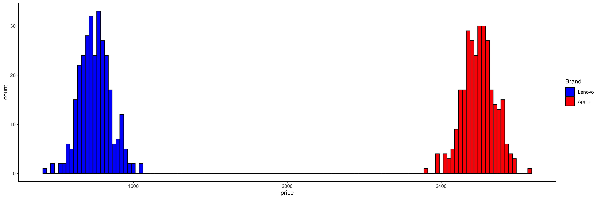
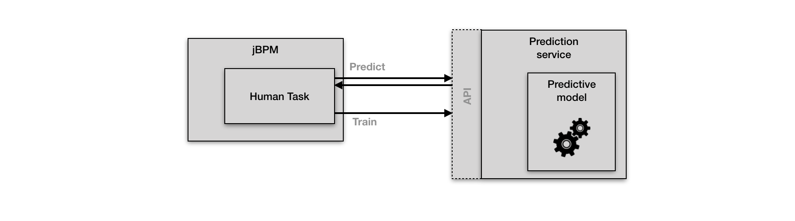
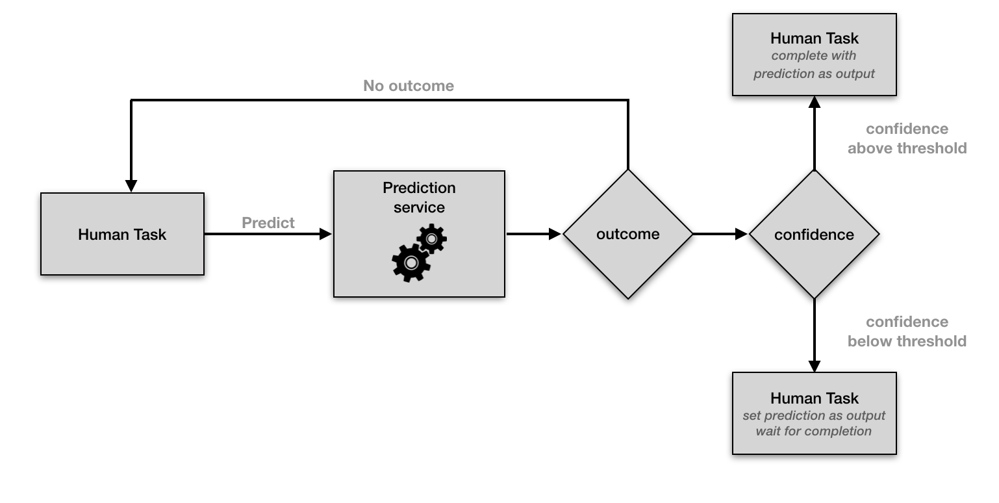
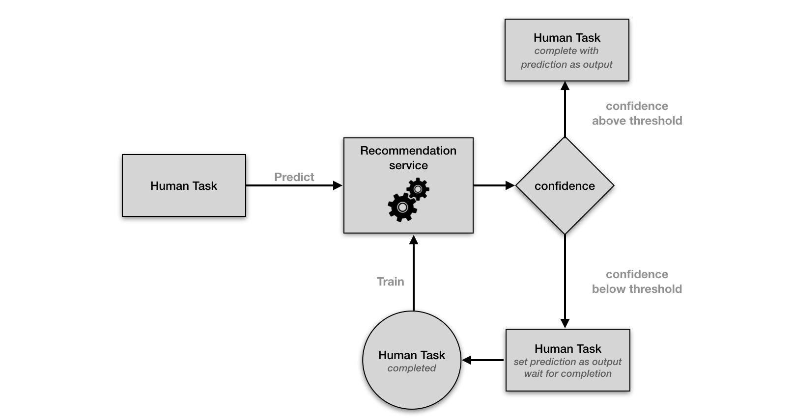
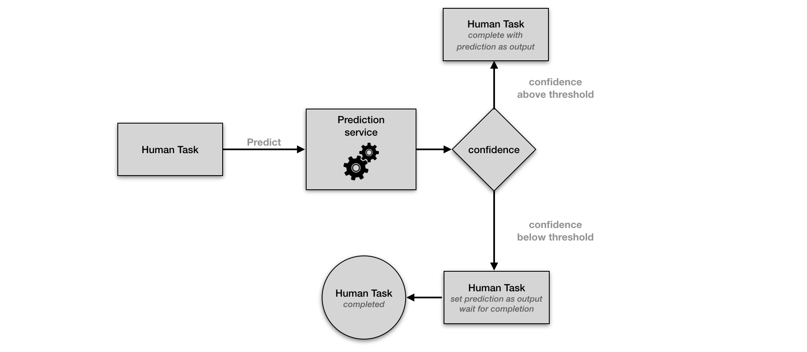

# jbpm-recommendation-demo

Demo project for the recommendation service API in jBPM.

First we will go through the necessary steps to setup the demo and lastly we will look at some implementation details on how the recommendation API works.
This will allow you to learn how to create your own machine learning (ML) based recommendation services and how to integrate them with jBPM.

# Setup

## jBPM

Download and install jBPM from [here](https://www.jbpm.org/download/download.html).

## Recommendation service

This repository contains two example recommendation service implementations as Maven modules and a REST client to populate the project with task to allow the predictive model training.
Start by downloading, or alternatively cloning, the repository:

```$shell
$ git clone git@github.com:ruivieira/jbpm-recommendation-demo.git
```

For this demo, two random forest-based services, one using the [SMILE](https://github.com/haifengl/smile) library and another as Predictive Model Markup Language ([PMML](https://en.wikipedia.org/wiki/Predictive_Model_Markup_Language)) model, will be used.
The services, located respectively in `services/jbpm-recommendation-smile-random-forest` and `services/jbpm-recommendation-pmml-random-forest`, can be built with (using SMILE as an example):

```shell
$ cd services/jbpm-recommendation-smile-random-forest
$ mvn clean install -T1C -DskipTests -Dgwt.compiler.skip=true  \
	-Dfindbugs.skip=true -Drevapi.skip=true -Denforcer.skip=true \
	-Dcheckstyle.skip=true
```

The resulting JARs files can then be included in the Workbench's `kie-server.war` located in `standalone/deployments` directory of your jBPM server installation. To do this, simply create a `WEB-INF/lib` , copy the compiled _jars_ into it and run

```shell
$ zip -r kie-server.war WEB-INF
```

The PMML-based service expects to find the PMML model in `META-INF`, so after copying the PMML file in `jbpm-recommendation-pmml-random-forest/src/main/resources/models/random_forest.pmml` into `META-INF`, it should also be included in the WAR by using

```shell
$ zip -r kie-server.war META-INF
```

jBPM will search for a recommendation service with an identifier specified by a Java property named `org.jbpm.task.prediction.service`. Since in our demo, the random forest service has the indentifier `SMILERandomForest`, we can set this value before starting the workbench, for instance as an environment variable:

```shell
$ export JAVA_OPTS="-Dorg.jbpm.task.prediction.service=SMILERandomForest"
```

For the purpose of this documentation we will illustrate the steps using the SMILE-based service. The PMML-based service can be used by setting the above environment variable as

```shell
$ export JAVA_OPTS="-Dorg.jbpm.task.prediction.service=PMMLRandomForest"
```

## Installing the project

Start the WB by running

```
./bin/standalone.sh
```

One the WB has completed the startup, you can go to [http://localhost:8080/business-central/](http://localhost:8080/business-central/) and login using the default admin credential `wbadmin/wbadmin`. After chosing the default workspace (or creating your own), then select "_Import project_" and use the project git URL:

```shell
https://github.com/ruivieira/jbpm-recommendation-demo-project.git
```

The project consists of a single Human Task, which can be inspected using the WB. The task is generic and simple enough in order to demonstrate the working of the jBPM's recommendation API.


For the purposes of the demonstration, this task will be used to model a simple purchasing task where the purchase of a laptop of a certain brand is requested and must be, eventually, manually approved. The tasks **inputs** are:

- `item` - a `String` with the brand's name
- `price` - a `Float` representing the laptop's price
- `ActorId` - a `String` representing the user requesting the purchase

The task provides as **outputs**:

- `approved` - a `Boolean` specifying whether the purchased was approved or not

## Batch creation of tasks

This repository contains a REST client (under `client`) which allows to add Human Tasks in batch in order to have sufficient data points to train the model, so that we can have meaningful recommendations.

***NOTE***: Before running the REST client, make sure that the Workbench is running and the demo project is deployed and also running.

The class  `org.jbpm.recommendation.demo.RESTClient` performs this task and can be executed from the `client` directory with:

```shell
$ mvn exec:java -Dexec.mainClass="org.jbpm.recommendation.demo.RESTClient"
```

The client will then simulate the creation and completion of human tasks, during which the model will be trained.

The tasks' completion will adhere to the following logic:

* The purchase of a laptop of brand `Lenovo` requested by user `John` or `Mary` will be approved if the price is around $1500
* The purchase of a laptop of brand `Apple` requested by user `John` or  `Mary` will be approved if the price is around $2500
* The purchase of a laptop of brand `Lenovo` requested by user `John` or  `Mary` will be rejected if the price is around $2500

The prices for Lenovo and Apple laptop are drawn from Normal distributions with respective means of 1500 and 2500 (pictured below). Although the recommendation service is not aware of the deterministic rules we've used to set the task outcome, it will train the model based on the data it receives.

In the following sections we will explain the internal working of a recommendation service, how to test this project in the Workbench and how to create your own recommendation service.



# Description

## API

jBPM offers an API which allows for predictive models to be trained with Human Tasks (HT) data and for HT to incorporate the model's predictions as outputs ore even complete a HT.

This is achieved by connecting the HT handling to a *recommendation service*. A recommendation service is simply any third-party class wich implements the `org.kie.internal.task.api.prediction.PredictionService` interface.



This interface consists of three methods:

- `getIdentifier()` - this methods simply returns a unique (`String`) identifier for your prediction service
- `predict(Task task, Map<String, Object> inputData)` - this method takes task information and the task's inputs from which we will derive the model's inputs, as a map. The method returns a `PredictionOutcome` instance, which we will look in closer detail later on
- `train(Task task, Map<String, Object> inputData, Map<String, Object> outputData)` - this method, similarly to `predict`, takes task info and the task's inputs, but now we also need to provide the task's outputs, as a map, for training

By default, if no other recommendation service is specified, jBPM will use a no-op service as defined in `org.jbpm.services.task.prediction.NoOpPredictionService`. This service returns an empty prediction and performs no training. jBPM processes will behave as if no recommendation prediction service is present.

It is important to note that the prediction service makes no assumptions about which features will be used for model training and prediction. The API exposes the task information, inputs and outputs, but it is up to the developer/data scientist to select which inputs and outputs will be used for training, or if pre-processing is necessary, for instance. 

The `PredictionOutcome` is a class which encapsulates the model's prediction for a certain `Map<String, Object> inputData`.

This class will contain:

- A `Map<String, Object> outcome` containing the prediction outputs, each entry represents a output attribute name and value. This map can be empty, which corresponds to the model not providing any prediction.
- A `confidence` value. The meaning of this field is left to the developer. As an example, it could represent a probability between `0.0` and `1.0`. It's relevance is related to the `confidenceThreshold` below.
- A `confidenceThreshold` - this value represents the `confidence` cutoff after which an action can be taken by the HT item handler.

As example, let's assume our `confidence` represents a prediction probability between `0.0` and `1.0`. If the `confidenceThreshold` is `0.7`, that would mean that for ` confidence > 0.7` the HT outputs would be set to the `outcome` and the task automatically closed. If the `confidence < 0.7`, then the HT would set the prediction `outcome` as suggested values, but the task would not be closed and still need human interaction. If the `outcome` is empty, then the HT lifecycle would proceed as if no prediction was made.



The initial step is then, as defined above, the `predict` step.

In the scenario where the the prediction's confidence is above the threshold, the task is automatically completed. If that the confidence is not above the threshold, however, when the task is eventually completed both the inputs and the outputs will then be used to further train the model by calling the prediction service's `train` method.



## Example implementations

### SMILE-based service

As we've seen previously, when creating and completing a batch of tasks (as previously) we are simultaneously training the predictive model. The service implementation is based on a random forest model a popular ensemble learning method.

After the model is trained with the task from `RESTClient`, we will now create a new Human Task.

If we create a HT requesting the purchase of an `Apple` laptop from `John` with the price $2500, we should expect it to be approved.

If fact, when claiming the task, we can see that the recommendation service recommends the purchase to be approved with a "confidence" of 91%.


If he now create a task for the request of a `Lenovo` laptop from `Mary` with the price $1437, he would expect it to be approved. We can see that this is the case, where the form is filled in by the recommendation service with an approved status with a "confidence" of 86.5%.


We can also see, as expected, what happens when `John` tries to order a `Lenovo` for $2700. The recommendation service fills the form as "not approved" with a "confidence" of 71%.


In this service, the confidence threshold is set as `0.95` and as such the task was not closed automatically.

### PMML-based service

The second example implementation is the PMML-based recommendation service. PMML is a predictive model interchange standard, which allows for a wide variety of models to be reused in different platforms and programming languages.

The service included in this demo consists of pre-trained model (with a dataset similar to the one generate by the `RESTClient`) which is executed by a PMML engine. For this demo, the engine used was [jpmml-evaluator](https://github.com/jpmml/jpmml-evaluator), the *de facto* reference implementation of the PMML specification.

There are two main differences when comparing this service to the SMILE-based one:

- *The model doesn't need the training phase.* The model has been already trained and serialised into the PMML format. This means that we can start using predictions straight away from jBPM.
- *The `train` API method is a no-op in this case*. This means that whenever the service's `train` method is called, it will not be used for training in this example (only the `predict` method is needed for a "read-only" model), as we can see from the figure below.



